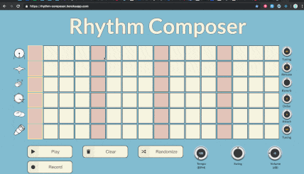

# Rhythm Composer

Rhythm Composer is a browser-based drum machine / 16 step sequencer. Users can play, create, edit and add effects to drum patterns in real-time. Created with React, each drum sound is synthesised with the Tone.js framework.

The project is live at the following link: https://rhythm-composer.herokuapp.com/

## Details

The grid represents a traditional 4/4 measure with each step representing 1/16 of that measure. Downbeats are represented by the red boxes. Each row of the grid has been assigned a drum sound which is shown by the icons on the left-hand side of the grid. Each of these drum sounds have an exclusive effect, pitch or envelope control, the parameters of which can be changed using the knobs on the right-hand side of each row. From top to bottom, the drum sounds and effects (in parentheses) are:

- Kickdrum (Tuning [Hz])
- Hihat (Release)
- Clap (Reverb)
- Snare (Ping-pong Delay)
- Cymbal (Attack)
- Conga (Tuning [Hz])

Drum patterns can be entered by the user by clicking on the boxes in the grid. Once clicked, the box will turn blue which shows it is activated and will be triggered at that given time in the 4/4 measure. 

When the user presses play, the loop starts and the current position will be shown by the yellow outline which will be moving across the grid. Users can edit their drum pattern in real-time.

The randomise button will create a random pattern. 

The record button will begin recording a .wav file of the sound output being produced by the sequencer which will be auto-downloaded to the users computer when the user stops the recording.

